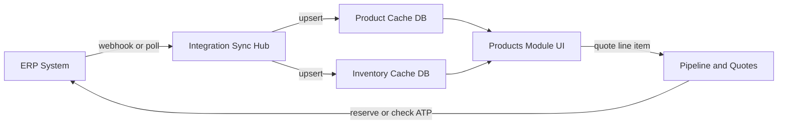
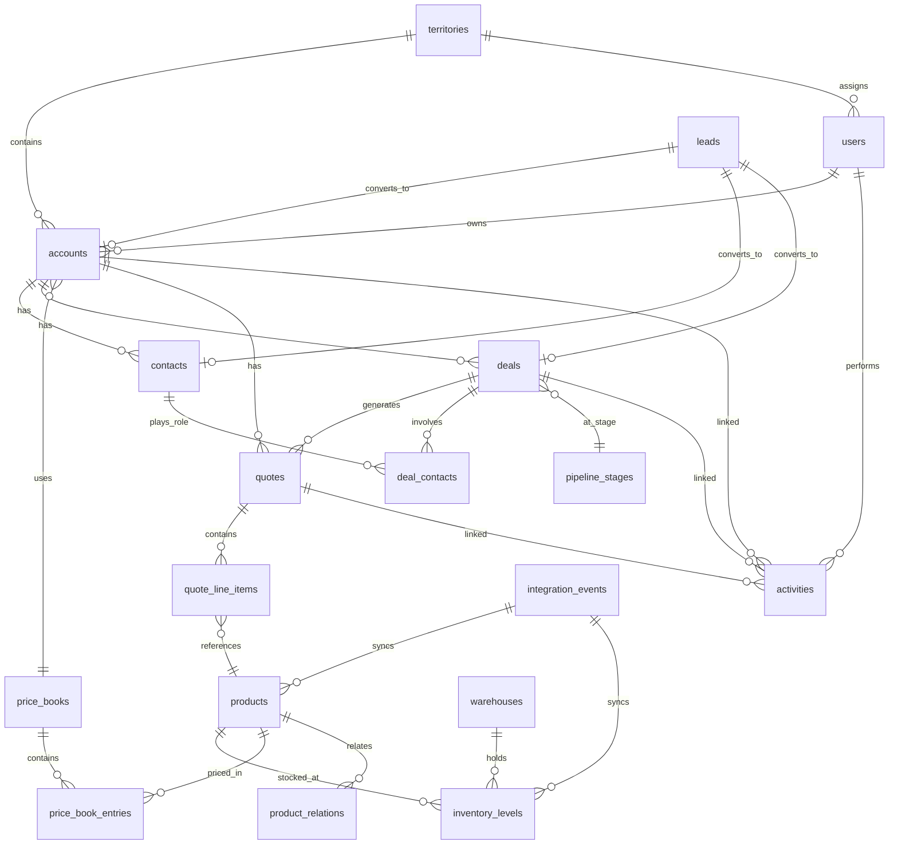

# Enterprise CRM Plan: B2B Electronics Distribution

**Project location:** `C:\Users\PC\Desktop\CRM`

**Target business profile:** Large enterprise wholesaler/distributor selling electronics B2B (resellers, retailers, integrators, VARs, dealers) — high-SKU catalogs, thin margins, ERP-centric operations, revenue driven primarily by existing accounts.

---

## Core Application Modules (Master Registry — 35 Modules)

*Consolidated from Zoho, SAP Sales Cloud V2, Salesforce Sales/Service/Revenue/PRM Cloud, and distribution/electronics requirements.*

| # | Module | Purpose | Source |
|---|--------|---------|--------|
| 1 | **Accounts** | Customer 360°, hierarchies, health scoring, account plans | All |
| 2 | **Contacts** | Multi-stakeholder mapping, contact roles on deals | All |
| 3 | **Leads** | Prospect intake, scoring, routing, conversion | All |
| 4 | **Pipeline & Deals** | Opportunity stages, teams, revenue splits, inspection | All |
| 5 | **Products** | Catalog + **live ERP inventory sync** | Custom + SAP + SF Revenue |
| 6 | **CPQ** | Configurator, constraint builder, price rules, guided selling | Zoho + SAP CPQ + SF Revenue |
| 7 | **Price Books** | Tiered/contract/volume pricing lists | Zoho + SAP + SF |
| 8 | **Quotes** | Quote builder, PDF, email, versioning, terms/tax | All |
| 9 | **Contracts / CLM** | Templates, clause library, redlining, e-signature, obligations | SF Revenue Cloud |
| 10 | **Orders** | Order creation, orchestration, fulfillment tracking | SAP + SF Revenue |
| 11 | **Invoices & Billing** | Invoice sync, billing schedules, DSO analytics | Zoho + SAP + SF |
| 12 | **Installed Base / Assets** | Customer-owned products, entitlements, renewals | SAP + SF (electronics warranty) |
| 13 | **Activities** | Calls, visits, tasks, meetings, auto-capture | All |
| 14 | **Cadences** | Multi-step follow-up sequences with branching | Zoho + SF Sales Engagement |
| 15 | **Workqueue** | Rep daily prioritized action list | Zoho + SAP |
| 16 | **Email Hub** | Sales inbox, tracking, parser, templates, scheduling | All |
| 17 | **Call Center / CTI** | Click-to-call, call scripts, call lists, recording, transcription | SAP + SF |
| 18 | **Territories** | Assignment, coverage, quotas, planning | All |
| 19 | **Forecasting** | Pipeline forecast, categories, what-if simulation, leakage | SAP + SF |
| 20 | **Partners / PRM** | Deal registration, MDF, enablement, co-selling, Partner Connect | SF PRM |
| 21 | **Vendors** | Supplier records, PO visibility, lead times | Zoho + SAP ERP |
| 22 | **Service / Cases** | Ticketing, SLA, omni-channel, escalation, NLP routing | SAP Service + SF Service |
| 23 | **RMA & Warranty** | Returns, repairs, warranty registration (electronics) | Custom |
| 24 | **Knowledge Base** | Articles, similar-case recommendations, self-service | All |
| 25 | **Incidents** | Bulk outages, major incident management | SF Service Cloud |
| 26 | **Field Service** | On-site visit scheduling, routing, mobile execution | SAP + SF Field Service |
| 27 | **Marketing** | Account-based campaigns, segmentation, autoresponders | All |
| 28 | **Documents** | Library, version control, datasheets, contracts | SAP + SF |
| 29 | **Portals** | Customer/partner self-service (Experience Cloud equivalent) | All |
| 30 | **Commissions / SPIFF** | Rep compensation, rebates, manufacturer SPIFF tracking | Distribution |
| 31 | **Reports & Analytics** | Dashboards, cohort, funnel, anomaly, embedded BI | All |
| 32 | **Data Platform** | Unified customer graph, identity resolution, enrichment | SF Data Cloud |
| 33 | **AI / Agents** | Copilot, autonomous agents, guided selling, trust layer | SAP Joule + SF Agentforce |
| 34 | **Integrations** | ERP, PIM, e-commerce, EDI, event bus, mashups, marketplace | SAP + SF |
| 35 | **Admin & Platform** | Custom modules, sandbox, layouts, security, compliance, search | All |

---

## Zoho CRM Gap Analysis (Added Modules & Features)

Compared against [Zoho CRM's complete feature list](https://www.zoho.com/crm/complete-feature-list.html). Items below were **missing from our plan** and are now added. Items we already exceed Zoho on are noted separately.

### Already Stronger Than Zoho (Keep as Differentiators)

| Our Feature | Zoho Equivalent | Why Ours Is Better |
|-------------|-----------------|-------------------|
| Live ERP inventory sync (real-time push) | Zoho Inventory module (internal, not ERP-native) | ERP is source of truth; sub-second stock for high-volume electronics |
| Electronics: serial/IMEI, RMA, EOL, export compliance | Not native | Industry-specific depth |
| EDI / multi-channel order ingestion | Limited via marketplace extensions | Core for large B2B distributors |
| Activity-to-revenue attribution | Not native | Distributor-specific ROI on rep activity |
| Wallet-share / account underspend alerts | Zia recommendations (generic) | Built for distribution buying patterns |

### New Modules Added (Inspired by Zoho, Adapted for Distribution)

#### Leads Module
- Lead capture, qualification, and scoring before conversion to Account/Contact/Deal
- Lead assignment rules and thresholds (round-robin, territory-based, load-balanced)
- Lead conversion wizard — map to existing account or create new
- **Lower priority for distribution** (most revenue = existing accounts) but needed for new reseller/VAR onboarding

#### CPQ Module (Configure, Price, Quote)
Zoho Professional+ includes CPQ — we need equivalent:
- **Product Configurator** — rules for compatible bundles, required accessories, blocked combinations
- **Price Rules** — direct pricing and volume-tier pricing per product/customer segment
- **Guided Selling** — question-based flow to help reps build the right quote (spec-based for electronics)
- Dynamic discount calculations with margin guardrails
- Quote templates with **Terms & Conditions** and **Tax Rates**
- Quotes dashboard — stalled quotes, expiring quotes, conversion KPIs

#### Price Books Module
- Named price lists per customer tier, region, or contract
- Link price books to accounts and quotes
- Sync base pricing from ERP; override rules in CRM for promotions

#### Vendors & Purchasing (Read-Sync from ERP)
- Vendor records tied to products and manufacturer lines
- Purchase order visbility (on-order qty feeds into Products inventory view)
- Supplier lead time and MOQ per SKU

#### Documents Module
- Central document library per account, deal, and product
- Attach contracts, NDAs, credit applications, datasheets
- Version history and access control

#### Email Hub
- CRM-integrated sales inbox (Gmail/Outlook/IMAP)
- Email association with deals, accounts, and quotes
- Email open/click tracking and response analytics
- **Email Parser** — auto-create leads/cases from inbound emails
- BCC dropbox for automatic email logging
- Organization email templates and scheduling

#### Cadences Module
- Multi-step follow-up sequences: email → call → task → WhatsApp
- Branching logic based on prospect response (opened email, no reply, etc.)
- Cadence templates per scenario: quote follow-up, reorder nurture, lapsed account win-back
- Per-rep workqueue showing next cadence steps due today

#### Portals Module
- Customer/partner self-service: view quotes, order history, invoices, support cases
- Partner lead registration and deal registration
- Product catalog browse with contracted pricing (no public pricing)
- RMA submission portal (electronics)

#### Knowledge Base (Solutions)
- Searchable articles: product FAQs, troubleshooting, warranty policies
- Link articles to cases and products
- Rep-facing and customer-facing views

#### Marketing Module (Account-Based, Not B2C)
- Campaigns targeting account segments (not cold leads)
- Mass email with opt-out compliance
- Autoresponders for onboarding new dealers/VARs
- Campaign ROI tied to account revenue (not just email opens)

### New Process & Automation Features (No Separate Module)

| Feature | Description | Phase |
|---------|-------------|-------|
| **Blueprint** | Visual process builder — enforce mandatory steps on quote/deal stages (e.g. credit check before quote send) | Phase 2 |
| **Approval Process** | Multi-level approvals: discount, margin, credit limit, quote value | Phase 2 |
| **Review Process** | Manager review gates before record moves to next stage | Phase 2 |
| **Journey Orchestration** | End-to-end automated customer journeys (onboarding → first order → review) | Phase 3 |
| **Multiple Pipelines** | Separate pipelines per product line (components, finished goods, telecom) | Phase 2 |
| **Workqueue** | Rep's daily prioritized task list across cadences, deals, and activities | Phase 1 |
| **Scoring Rules** | Account/deal scoring on purchase frequency, margin, payment behavior | Phase 2 |
| **Assignment Rules** | Auto-route new leads/deals to correct rep by territory/product | Phase 1 |
| **Contact Roles** | Stakeholder roles on deals (Decision Maker, Influencer, Procurement, Technical) | Phase 1 |
| **Record Locking** | Lock quote/deal during approval — no edits until approved/rejected | Phase 2 |
| **Duplicate Detection** | Find and merge duplicate accounts/contacts | Phase 1 |
| **Webhooks** | Outbound event triggers to ERP, e-commerce, messaging systems | Phase 1 |
| **Custom Functions** | Server-side logic in workflows (e.g. complex margin calculation) | Phase 3 |

### New Analytics Features (Extend Reports Module)

| Feature | Description |
|---------|-------------|
| Scheduled report delivery | Auto-email dashboards to managers on schedule |
| Funnel analysis | Conversion rates between pipeline stages |
| Cohort analysis | Account retention and reorder cohorts over time |
| Anomaly detection | Flag unusual drop in orders, margin, or activity per account |
| Waterfall charts | Forecast changes week-over-week |
| Quadrant analysis | Accounts plotted by revenue vs. margin |
| Quotes dashboard | CPQ-specific KPIs: open, stalled, won, lost quotes |

### New AI Features (Extend Tier 4 — Zoho Zia Equivalents)

| Feature | Zoho Zia Equivalent |
|---------|-------------------|
| Best time/mode to contact | Best Time / Mode to Contact |
| Churn / dormancy prediction | Churn Prediction |
| Email/call summary & sentiment | Email/Call Summary, Sentiment |
| Competitor mention alerts | Competitor Alert |
| Conversational CRM assistant | Ask Zia |
| Next-best product on quote | Zia CPQ Recommendations |
| Data enrichment (company info) | Data Enrichment |
| AI writing assistant for emails | Zia Writing Assistant |

### New Platform & Customization Features

| Feature | Description | Phase |
|---------|-------------|-------|
| **Custom Modules** | No-code creation of new record types (e.g. Rebate Claims, Trade Shows) | Phase 3 |
| **Canvas UI Builder** | Drag-drop custom list/detail/form views per module | Phase 3 |
| **Layout Editor** | Multiple page layouts per module (inside sales vs. field rep view) | Phase 2 |
| **Validation & Layout Rules** | Conditional show/hide fields, mandatory rules per stage | Phase 2 |
| **Subforms** | Nested line items on custom records | Phase 2 |
| **Wizards** | Multi-step guided record creation | Phase 2 |
| **Sandbox** | Isolated environment to test config changes before production | Phase 3 |
| **Kanban / Timeline / Grid views** | Alternative views for deals, quotes, and activities | Phase 2 |
| **Teamspaces** | Collaborative workspaces per product line or region | Phase 3 |
| **Field-level encryption** | Encrypt sensitive fields (credit limits, contract terms) | Phase 3 |
| **GDPR / compliance settings** | Data retention, consent, right-to-delete tooling | Phase 3 |

### New Communication Integrations

| Integration | Purpose |
|-------------|---------|
| PBX / PhoneBridge | Click-to-call, auto-log calls, call recording links |
| WhatsApp Business | Cadence follow-ups, quote sharing, order notifications |
| Microsoft Teams / Slack | Deal notifications, approval requests |
| Calendar sync | Outlook/Google — meetings linked to accounts |

### Intentionally Deprioritized (Low Value for B2B Distribution)

| Zoho Feature | Why Skip or Defer |
|--------------|-------------------|
| Social tab (Facebook/X) | B2B electronics buyers don't convert via social |
| Webform A/B testing | Low inbound lead volume for distributors |
| Visitor tracking (SalesIQ) | Low priority; B2B portal analytics preferred |
| Calendar booking (self-serve) | Niche for B2B; Phase 4 optional |
| Web-to-Lead forms | Low priority; relationship-driven sales |

---

## SAP Sales Cloud V2 Gap Analysis

Compared against [SAP Sales Cloud V2](https://learning.sap.com/courses/exploring-sap-sales-cloud-version-2/getting-an-overview-about-sap-sales-cloud-version-2), [SAP features](https://www.sap.com/products/crm/sales-cloud/features.html), and [SAP vs Salesforce comparison](https://acbaltica.com/press/sap-sales-cloud-v2-vs-salesforce-sales-cloud/).

### SAP Features Added to Plan

| Feature | Description | Phase |
|---------|-------------|-------|
| **Guided Selling Playbooks** | Dynamic step-by-step playbooks with next-best-action per deal stage | Phase 2 |
| **Deal Intelligence** | ML scoring of deal probability based on engagement + ERP history | Phase 5 |
| **Relationship Strength** | Score relationship health per contact/account stakeholder | Phase 5 |
| **Engagement Insights** | Activity pattern analysis per account (calls, emails, meetings) | Phase 5 |
| **Forecast What-If Simulation** | Model forecast changes by adjusting deal probabilities | Phase 3 |
| **Pipeline Manager & Pipeline Flow** | Visual pipeline flow, bottleneck detection, stage leakage | Phase 2 |
| **Dynamic Visit Planning** | AI-optimized field visit routing and scheduling | Phase 3 |
| **Call Lists & Call Scripts** | Outbound call campaigns with scripted talk tracks | Phase 2 |
| **CTI / Teams Telephony** | Computer telephony integration, click-to-call, auto-log | Phase 2 |
| **Meeting Insights** | AI extraction of action items and insights from meetings | Phase 5 |
| **Sales Campaigns** | Target-group campaigns for account segments | Phase 3 |
| **Autoflow** | Event/condition-based automation (email, notifications, field updates) | Phase 2 |
| **Elastic Global Search** | Fuzzy search, autocomplete, saved searches, field filters | Phase 1 |
| **Mashup / Screen Embedding** | Embed ERP screens (pricing, stock, orders) inside CRM UI | Phase 2 |
| **Event Bus (ERP Events)** | Subscribe to ERP business events (stock change, shipment, invoice) | Phase 1 |
| **Embedded Analytics (BI)** | SAP Analytics Cloud equivalent — operational dashboards | Phase 3 |
| **Installed Base Management** | Track products sold/installed per account for warranty/reorder | Phase 4 |
| **Lead Booster** | ML-powered lead scoring and prioritization | Phase 5 |
| **Account Summarization (AI)** | One-click AI summary of account history and status | Phase 5 |
| **Email Draft Recommender** | AI-generated email drafts contextual to deal/account | Phase 5 |
| **Content Management Library** | Central repository for sales content, presentations, battle cards | Phase 2 |
| **Joule Copilot** | Conversational AI across CRM with ERP context | Phase 5 |
| **Agentic AI Orchestration** | AI agents that prepare quotes, route approvals, draft comms | Phase 5 |
| **LCNC Extensibility** | Low-code/no-code app builder for custom extensions | Phase 3 |
| **Admin Console** | Business-user admin with search, favorites, config history | Phase 2 |
| **Data Import/Export Wizard** | Visual bulk data management with validation | Phase 1 |
| **DPP / GDPR Tools** | Data disclosure, de-personalization, access logs | Phase 3 |
| **Channel Orchestration** | Right-time info delivery across sales + service channels | Phase 3 |
| **Deal Sheet Generation** | AI-assisted commercial deal sheets (SAP Revenue Growth Mgmt) | Phase 3 |
| **Gamification** | Rep leaderboards, targets, motivator widgets | Phase 5 (optional) |

### SAP Native Strengths We Match

| SAP Capability | Our Equivalent |
|----------------|----------------|
| Quote-to-order with ERP pricing | CPQ + Quotes + ERP sync |
| Native ERP master data integration | Integration Hub + ERP adapters |
| Advanced pricing aligned with ERP | Price Books + CPQ price rules |
| Field sales mobile (iOS/Android) | Mobile app with offline (Phase 3) |
| Territory management | Territories module |
| Outlook/Gmail server-side sync | Email Hub |

---

## Salesforce Gap Analysis

Compared against [Salesforce Sales Cloud](https://www.salesforce.com/products/sales-cloud/features/), [Revenue Cloud](https://www.salesforce.com/products/revenue-cloud/overview/), [PRM](https://www.salesforce.com/products/partner-relationship-management/overview/), and [Service Cloud](https://www.salesforce.com/products/service-cloud/overview/).

### Salesforce Features Added to Plan

| Feature | Description | Phase |
|---------|-------------|-------|
| **Einstein Activity Capture** | Auto-log emails, meetings, contacts from Gmail/Outlook | Phase 2 |
| **Pipeline / Deal Inspection** | Deep dive into deal changes, stage history, risk flags | Phase 2 |
| **Account Plans & SWOT** | Strategic account planning with SWOT, goals, mutual action plans | Phase 3 |
| **Mutual Action Plans** | Shared customer-facing plan with milestones both sides track | Phase 3 |
| **Opportunity Teams** | Multi-rep collaboration on deals with role-based access | Phase 2 |
| **Revenue Splits** | Split deal credit across multiple reps/teams | Phase 3 |
| **Forecast Categories** | Commit / Best Case / Pipeline / Omitted forecast buckets | Phase 2 |
| **Collaborative Forecasting** | Manager rep forecast roll-up with adjustment and override | Phase 2 |
| **Sales Path** | Visual guidance on opportunity stages (key fields, tips) | Phase 2 |
| **Flow Builder** | Visual drag-drop workflow automation (equivalent to Salesforce Flow) | Phase 2 |
| **Constraint Builder (CPQ)** | Rule engine for product compatibility and configuration constraints | Phase 2 |
| **Attribute-Based Product Catalog** | Product catalog by attributes not just SKU (SF Revenue Cloud) | Phase 2 |
| **Contract Lifecycle Management** | Clause library, template management, redlining, version compare | Phase 3 |
| **E-Signature Integration** | DocuSign/Adobe Sign for quote and contract signing | Phase 3 |
| **Asset Lifecycle Management** | Track customer-owned assets, amendments, renewals, cancellations | Phase 4 |
| **Order Orchestration** | Fulfillment plan viewer, task breakdown, dependency tracking | Phase 3 |
| **Order Fallout Management** | Failed task alerts, overdue fulfillment, retry workflows | Phase 3 |
| **Billing & Revenue Recognition** | Billing schedules, revenue recognition rules (ERP sync) | Phase 4 |
| **Pricing Analytics** | Margin/revenue/pricing performance dashboards (Tableau-equivalent) | Phase 3 |
| **Deal Registration** | Partners register deals for protection and approval | Phase 3 |
| **MDF / Co-op Marketing Funds** | Partner marketing fund requests, approvals, tracking | Phase 3 |
| **Partner Connect** | Cross-CRM secure deal sharing with external partner orgs | Phase 4 |
| **Partner Enablement** | Training content, certifications, onboarding paths for partners | Phase 3 |
| **Partner Marketing Automation** | Co-branded campaigns, prebuilt partner journeys | Phase 3 |
| **PRM Analytics** | Partner pipeline, win rates, revenue attribution dashboards | Phase 3 |
| **Omni-Channel Routing** | Route cases/leads to right agent by skills, load, priority | Phase 3 |
| **Live Chat & Chatbot** | Website/portal chat with AI bot escalation to agent | Phase 4 |
| **Digital Engagement** | Messaging across SMS, WhatsApp, social, chat in one console | Phase 4 |
| **Incident Management** | Bulk customer impact tracking, major incident workflows | Phase 4 |
| **Similar Case Recommendations** | AI suggests related resolved cases (SAP + SF) | Phase 5 |
| **Case Classification (NLP)** | Auto-categorize and route incoming cases | Phase 5 |
| **Field Service Management** | On-site technician scheduling, work orders, mobile execution | Phase 4 |
| **Data Cloud / Customer Graph** | Unified identity across CRM, ERP, e-commerce, marketing | Phase 4 |
| **Data Enrichment** | Auto-fill company data (D&B, Clearbit equivalent) | Phase 5 |
| **Agentforce / Autonomous Agents** | AI agents that execute tasks: generate quotes, update records, send emails | Phase 5 |
| **Einstein Copilot** | Conversational CRM assistant in natural language | Phase 5 |
| **AI Trust Layer** | AI data masking, audit, toxicity filters, consent governance | Phase 5 |
| **Chatter / Social Feed** | Internal @mentions, record feeds, team collaboration | Phase 2 |
| **Salesforce Anywhere** | Browser extension — CRM sidebar in email/LinkedIn/web | Phase 3 |
| **App Marketplace** | Extension store for third-party integrations (AppExchange equivalent) | Phase 4 |
| **DevOps / Change Management** | Sandbox → staging → production deployment pipeline | Phase 3 |
| **Record Types** | Multiple record types per module with different layouts/picklists | Phase 2 |
| **Permission Sets** | Granular additive permissions beyond roles | Phase 2 |
| **Field History Tracking** | Audit trail of field changes per record | Phase 2 |
| **Shield / Event Monitoring** | Login forensics, transaction security, enhanced audit | Phase 4 |
| **RevOps Dashboard** | Cross-functional revenue metrics for sales/finance/legal alignment | Phase 3 |
| **Web-to-Case / Web-to-Lead** | Public forms for case and lead intake | Phase 3 |
| **Sales Programs** | Structured selling initiatives with targets and tracking | Phase 3 |
| **Subscription Management** | Recurring revenue tracking for service contracts (where applicable) | Phase 4 (optional) |

### Salesforce Features Covered by Existing Plan

| Salesforce Feature | Already In Plan |
|--------------------|-----------------|
| Lead Management | Leads module |
| Account & Opportunity Management | Accounts + Pipeline |
| Activity Management | Activities + Einstein Activity Capture (added) |
| Forecast Management | Forecasting module (enhanced) |
| Reports & Dashboards | Reports & Analytics |
| Workflow Automation | Flow Builder + Blueprint + Autoflow |
| Quoting & Approvals | CPQ + Quotes + Approval Process |
| Territory Management | Territories |
| Experience Cloud (Portals) | Portals |
| Knowledge Management | Knowledge Base |
| Duplicate Management | Duplicate Detection |
| Mobile CRM | Mobile app (Phase 3) |

---

## Complete Feature Checklist (Nothing Missed)

*Every feature from Zoho + SAP + Salesforce mapped. ✅ = in plan.*

### Sales Force Automation
- ✅ Leads, Accounts, Contacts, Deals/Opportunities
- ✅ Lead scoring, assignment rules, conversion
- ✅ Contact roles on opportunities
- ✅ Opportunity teams, revenue splits
- ✅ Multiple pipelines, sales paths, kanban
- ✅ Activity management (tasks, calls, meetings, events)
- ✅ Auto activity capture (email/calendar)
- ✅ Workqueue / rep to-do list
- ✅ Cadences / sales engagement sequences
- ✅ Territory management and planning
- ✅ Quota management
- ✅ Forecasting (collaborative, categories, what-if)
- ✅ Pipeline inspection / deal intelligence
- ✅ Account plans, SWOT, mutual action plans
- ✅ Guided selling playbooks
- ✅ Sales campaigns with target groups
- ✅ Call lists, call scripts, CTI telephony
- ✅ Calendar sync (Outlook/Google)
- ✅ Meeting insights (AI)
- ✅ Document library / content management
- ✅ Social feed / Chatter (internal)
- ✅ Gamification / leaderboards (optional)
- ✅ Mobile selling (iOS/Android, offline Phase 3)
- ✅ Browser extension (CRM sidebar)
- ✅ Global search (elastic, fuzzy, saved)
- ✅ Macros / quick actions
- ✅ Recurring activities

### CPQ & Revenue
- ✅ Product catalog (attribute-based)
- ✅ Product configurator with constraint builder
- ✅ Price books, volume pricing, contract pricing
- ✅ Price rules (direct + tiered)
- ✅ Guided selling flows
- ✅ Quote builder, PDF, email quote
- ✅ Terms & conditions, tax rates on quotes
- ✅ Quote versioning, expiration, dashboard
- ✅ Contract lifecycle management (CLM)
- ✅ Clause library, redlining, e-signature
- ✅ Approval workflows (discount, margin, credit)
- ✅ Order management and orchestration
- ✅ Fulfillment plan tracking
- ✅ Invoice and billing sync
- ✅ Revenue recognition (ERP sync)
- ✅ Pricing analytics
- ✅ Asset / installed base management
- ✅ Amendments, renewals on contracts
- ✅ Subscription tracking (optional for service contracts)
- ✅ Commission / SPIFF / rebate tracking

### Products & Inventory (Our Differentiator)
- ✅ Live ERP inventory sync (real-time push)
- ✅ ATP, allocated, on-order, in-transit, backorder
- ✅ Multi-warehouse stock visibility
- ✅ Substitutes, alternates, upsells, accessories
- ✅ EOL / obsolescence management
- ✅ Kit / BOM configuration
- ✅ Serial number, IMEI, lot traceability
- ✅ PIM integration
- ✅ Vendor / supplier management
- ✅ Purchase order visibility

### Service & Support
- ✅ Case / ticket management
- ✅ SLA management and escalation
- ✅ Knowledge base / solutions
- ✅ Web-to-case forms
- ✅ Omni-channel routing (email, phone, chat, portal)
- ✅ Live chat and AI chatbot
- ✅ Digital engagement (WhatsApp, SMS)
- ✅ RMA workflows (electronics)
- ✅ Warranty registration and tracking
- ✅ Field service / on-site visits
- ✅ Incident management (bulk outages)
- ✅ Similar case recommendations (AI)
- ✅ Case NLP classification (AI)
- ✅ Customer self-service portal

### Partner / Channel (PRM)
- ✅ Partner onboarding and tiers
- ✅ Deal registration and protection
- ✅ MDF / co-op marketing funds
- ✅ Partner portals
- ✅ Partner enablement (training, certifications)
- ✅ Partner marketing automation
- ✅ Partner analytics and scorecards
- ✅ Partner Connect (cross-org deal sharing)
- ✅ Co-selling workflows
- ✅ Channel pricing and rebates

### Marketing
- ✅ Account-based campaigns
- ✅ Segmentation and target groups
- ✅ Mass email with opt-out
- ✅ Email templates and autoresponders
- ✅ Campaign ROI tracking
- ✅ Landing pages / web forms (web-to-lead)
- ✅ A/B testing (deferred, low priority)

### Analytics & BI
- ✅ Standard and custom reports
- ✅ Custom dashboards
- ✅ Scheduled report delivery
- ✅ Funnel, cohort, waterfall, quadrant analysis
- ✅ Anomaly detection
- ✅ Target meters and KPI widgets
- ✅ Leaderboards
- ✅ Embedded BI (SAP Analytics Cloud equivalent)
- ✅ RevOps cross-functional dashboard
- ✅ Activity-to-revenue attribution
- ✅ Wallet-share analysis
- ✅ Pipeline leakage analysis

### AI & Intelligence
- ✅ AI copilot (conversational CRM)
- ✅ Autonomous AI agents (quote gen, email, routing)
- ✅ Next-best-action recommendations
- ✅ Lead/deal scoring (ML)
- ✅ Churn / dormancy prediction
- ✅ Reorder prediction
- ✅ Email/call summary, sentiment, intent
- ✅ Competitor mention alerts
- ✅ Best time/mode to contact
- ✅ Data enrichment
- ✅ AI writing assistant
- ✅ Product recommendations on quotes
- ✅ AI trust layer / governance
- ✅ Deal sheet generation (AI)

### Automation & Process
- ✅ Workflow rules (trigger → actions)
- ✅ Flow builder (visual automation)
- ✅ Blueprint (stage-gate enforcement)
- ✅ Approval processes (multi-level)
- ✅ Review processes
- ✅ Journey orchestration
- ✅ Assignment rules and thresholds
- ✅ Webhooks (outbound events)
- ✅ Custom functions / server-side logic
- ✅ Custom schedules (cron jobs)
- ✅ Record locking during approval
- ✅ Validation rules
- ✅ Layout rules (conditional fields)
- ✅ Autoflow (event-driven automation)

### Platform & Customization
- ✅ Custom modules (no-code)
- ✅ Custom fields (all types)
- ✅ Layout editor (multiple layouts per module)
- ✅ Record types
- ✅ Canvas / drag-drop UI builder
- ✅ Wizards (multi-step creation)
- ✅ Subforms (nested line items)
- ✅ Custom buttons and links
- ✅ Client-side scripts
- ✅ Server-side functions
- ✅ Sandbox environments
- ✅ DevOps deployment pipeline
- ✅ App marketplace / extension store
- ✅ Mashup / iframe embedding
- ✅ API-first (REST + events)
- ✅ LCNC app builder
- ✅ Teamspaces / collaborative workspaces
- ✅ Dark mode
- ✅ Multi-language / multi-currency
- ✅ Multi-company / multi-entity

### Security & Compliance
- ✅ RBAC (profiles, roles, permission sets)
- ✅ Field-level security
- ✅ Record-level sharing rules
- ✅ Territory-based data access
- ✅ SSO (SAML/OIDC)
- ✅ MFA
- ✅ Field-level encryption
- ✅ Audit logs / field history
- ✅ Event monitoring / login forensics
- ✅ GDPR tools (consent, deletion, export)
- ✅ HIPAA settings (if needed)
- ✅ Export compliance (ECCN screening)
- ✅ AI trust / data masking layer
- ✅ IP allowlisting
- ✅ Data backup and restore

### Integrations
- ✅ ERP (bi-directional, adapter pattern)
- ✅ PIM / product data
- ✅ B2B e-commerce
- ✅ EDI order ingestion
- ✅ Email (Gmail, Outlook, IMAP)
- ✅ Calendar (Google, Outlook)
- ✅ PBX / telephony (Teams, VoIP)
- ✅ WhatsApp Business
- ✅ Slack / Teams notifications
- ✅ E-signature (DocuSign, Adobe Sign)
- ✅ Event bus (ERP webhook stream)
- ✅ Data enrichment APIs
- ✅ BI tools export
- ✅ Marketplace extensions

### Electronics-Specific (Industry Layer)
- ✅ Serial / IMEI / lot traceability
- ✅ RMA and warranty lifecycle
- ✅ EOL and successor product mapping
- ✅ Technical spec-based search
- ✅ BOM / kit assembly for integrators
- ✅ Supplier allocation during shortages
- ✅ Manufacturer rebate / SPIFF
- ✅ Export control (ECCN, end-user screening)
- ✅ Certification tracking (FCC, CE, RoHS, UL)
- ✅ Installed base for warranty lookups

### Intentionally Deferred (Present in SAP/SF but Low ROI for B2B Distribution)
- ⏳ B2C social media integration (Facebook/X tab)
- ⏳ Website visitor deanonymization (SalesIQ equivalent)
- ⏳ Retail execution / planogram (SAP retail feature)
- ⏳ Subscription/recurring billing (only if service contracts needed)
- ⏳ Webform A/B testing
- ⏳ Self-serve calendar booking for prospects

---

## Products Module (Dedicated — User Requirement)

The **Products** module is a first-class section of the CRM, not a sub-feature of quotes. Sales reps, inside sales, and managers browse and search products independently, with inventory always reflecting ERP truth.

### Product Catalog Features
- High-SKU catalog with variants (voltage, wattage, form factor, compatibility, certifications)
- Manufacturer part numbers, UPC/EAN, internal SKU, and supplier cross-references
- Product images, datasheets, spec sheets, and sell sheets
- Category and attribute-based search and filtering
- **Substitutes, alternates, upsells, and accessories** linked per SKU
- EOL/obsolescence flags with successor product mapping
- Kit/BOM definitions for integrator bundles

### Live Inventory Tracking (ERP-Synced)
- **Real-time or near-real-time sync** from ERP (target: sub-minute for critical stock; configurable polling/webhook)
- Stock visibility **by warehouse, location, and bin** (multi-warehouse support)
- Available-to-promise (ATP) quantity — on-hand minus allocated/reserved
- **Allocated, on-order, in-transit, and backorder** quantities per SKU
- Low-stock and out-of-stock alerts configurable by product/category
- Incoming PO ETA visibility for backordered items
- Inventory snapshot history for demand analysis

### ERP Sync Architecture (Products ↔ ERP)



**Sync rules (real-time target):**
- ERP is **source of truth** for inventory quantities and pricing — CRM never writes stock levels
- **Push-based sync** via ERP webhooks or message queue (e.g. stock adjustment, receipt, shipment, allocation, PO receipt, warehouse transfer)
- CRM maintains a **local inventory cache** updated on every push event for sub-second UI reads
- ERP-agnostic **adapter interface** — swap adapter per ERP without changing Products module
- Conflict handling: ERP always wins on quantity; CRM logs `last_synced_at` per SKU/warehouse
- Fallback: if push stream drops, show stale indicator and trigger on-demand ERP refresh for active quote

### Products UI Views
- **Product list** — searchable grid with inline stock badges (green/amber/red)
- **Product detail** — full specs, docs, stock by warehouse, price tiers, related products
- **Inventory dashboard** — low stock, backorders, fast movers, dead stock
- **Compare view** — side-by-side specs for substitute products
- **Quick-add to quote** — add to active quote from any product view

### Products ↔ Other Modules
- **Quotes:** pull live ATP when adding line items; block or warn on insufficient stock
- **Accounts:** show products purchased history and reorder suggestions per account
- **Pipeline:** attach recommended products to opportunities
- **Reports:** inventory turnover, stock-out impact on lost deals
- **Service/RMA:** link serial numbers to product records

---

## Tier 1 — Must-Have Core Features

### 1. Customer & Account 360°
- Account hierarchy (parent/child, buying groups, branches)
- Multi-stakeholder contacts (procurement, technical, finance, warehouse)
- Interaction history, order history, credit terms, health scoring

### 2. Territory & Sales Team Management
- Territory by region, product line, or account tier
- Inside + field sales with mobile access
- Manager dashboards: coverage, quota, activity

### 3. Opportunity & Pipeline (B2B-Adapted)
- Stages: RFQ → quote → approval → PO → fulfillment
- Multi-decision-maker deals, weighted forecasting
- Quote-to-order with discount/margin/credit approvals

### 4. Quote & Order Management
- Quote builder with bundles, kits, volume pricing from ERP
- Margin visibility, versioning, expiration
- Order status: allocated, shipped, backordered

### 5. ERP Integration (Non-Negotiable)
- Bi-directional sync: customers, products, pricing, inventory, orders, invoices
- Eliminate duplicate data entry

### 6. Activity Automation
- Reorder reminders, quote follow-ups, dormant account alerts
- Low-friction activity logging (auto-capture where possible)

### 7. Reporting & Analytics
- Sales by rep, territory, category, manufacturer
- Wallet-share analysis, pipeline forecasting, quote conversion

---

## Tier 2 — Enterprise-Scale Features

- Channel & partner management (PRM) — dealers, VARs, rebate tracking
- Multi-channel sales (inside, field, B2B portal, EDI, marketplaces)
- Advanced pricing: contracts, tiers, margin floors, approval workflows
- Demand forecasting from pipeline + purchase history
- Account-based marketing (reorder campaigns, EOL migration, new product launches)
- Customer service & case management with SLA tracking
- Enterprise security: RBAC, SSO, MFA, audit trails, SOC 2-grade controls
- Multi-company, multi-currency, multi-warehouse scalability

---

## Tier 3 — Electronics-Specific Features

- Serial number, IMEI, and lot traceability (receipt → sale → warranty → RMA)
- Warranty and RMA workflows integrated with warehouse
- Product lifecycle and obsolescence management
- Technical compatibility selling and BOM/kit assembly
- Supplier/manufacturer rebate and allocation management
- Export compliance (ECCN, end-user screening)

---

## Tier 4 — AI & Intelligence

- Next-best-action per account (who to call, what to sell, when)
- Reorder prediction from buying cadence
- Activity-to-revenue attribution
- Cross-sell/upsell and margin-optimized product suggestions

---

## Build Phases (Final — Post Zoho + SAP + Salesforce Analysis)

| Phase | Focus | Key Deliverables |
|-------|-------|------------------|
| **Phase 1 — MVP** | Core sales + inventory | Modules 1–8, 13–16, 18, 31 (basic), 34–35: Accounts, Contacts, Leads, Pipeline, **Products (live ERP sync)**, CPQ basics, Price Books, Quotes, Activities, Workqueue, Email Hub, Territories, Global Search, Event Bus, Webhooks, Duplicate Detection, Data Import Wizard, Reports |
| **Phase 2 — Distribution** | Commercial execution | Modules 9–12, 17, 19, 22 (basic), 28: Orders, Invoices, Contracts basics, Cadences, CTI, Forecasting, Blueprint, Flow Builder, Approval Process, Constraint Builder, Guided Selling, Documents, Vendors, Pipeline Inspection, Opportunity Teams, Sales Path, Chatter, Activity Capture, Mashups, Admin Console |
| **Phase 3 — Enterprise** | Scale + channel | Modules 20–21, 25–27, 29–30, 33 (basic): PRM, CLM, Portals, Marketing, Field Service planning, Incidents, Account Plans, MDF, Deal Registration, Journey Orchestration, Order Orchestration, RevOps Dashboard, Embedded BI, Custom Modules, Sandbox, EDI, SSO, GDPR, LCNC builder, App Marketplace |
| **Phase 4 — Electronics** | Industry depth | Modules 12, 23–24, 26: Installed Base, Serial/IMEI, RMA/Warranty, EOL, Knowledge Base, Field Service, Live Chat, Digital Engagement, Export Compliance, Partner Connect, Billing sync, Asset Lifecycle |
| **Phase 5 — Intelligence** | AI + agents | Module 32–33 full: Data Platform, Joule/Einstein Copilot, Agentforce agents, Deal Intelligence, Churn Prediction, Meeting Insights, NLP Case Routing, Reorder Prediction, Revenue Attribution, AI Trust Layer, Gamification |

**Note:** Products module with live inventory sync is **Phase 1** — reps cannot quote accurately without it.

---

## Phase 1 MVP — LOCKED SCOPE

*Status: **LOCKED** — 2026-06-20. Changes require explicit scope review.*

*Implementation: **STARTED** — 2026-06-20. Scaffold complete; see `README.md` for run instructions.*

### MVP Goal (One Sentence)

Enable inside sales reps to manage accounts, browse products with **live ERP inventory**, build quotes with correct pricing, and track deals through a single pipeline — with managers seeing pipeline and quote KPIs.

### MVP User Personas

| Persona | Primary Jobs |
|---------|--------------|
| **Inside Sales Rep** | Call accounts, build quotes, check stock, log activities, manage workqueue |
| **Sales Manager** | View team pipeline, quote conversion, rep activity, reassign accounts |
| **CRM Admin** | Import data, manage users/territories, configure assignment rules, monitor ERP sync |

### MVP Success Criteria (Definition of Done)

1. Rep can search 10,000+ products and see ATP stock updated within **≤ 30 seconds** of ERP event
2. Rep can create a quote with line items, volume pricing from price book, and margin % visible
3. Rep gets a **warning** (not hard block in MVP) when quote qty exceeds ATP
4. Lead converts to Account + Contact + Deal in one wizard
5. Manager dashboard shows: pipeline by stage, open quotes, quotes won/lost (30 days)
6. Duplicate accounts flagged on create (fuzzy name + tax ID match)
7. ERP sync status visible to admin; failed sync events alertable via webhook
8. 5 concurrent reps using system without perceptible search lag (&lt; 500ms product search)

### MVP IN Scope ✅

| Area | Included in MVP |
|------|-----------------|
| **Modules** | Accounts, Contacts, Leads, Deals, Products, Price Books, Quotes, Activities, Workqueue, Email Hub (basic), Territories, Reports (5 standard), Integrations, Admin |
| **Accounts** | CRUD, parent/child hierarchy (1 level), owner, territory, credit terms (read from ERP), account type (customer/prospect/partner) |
| **Contacts** | CRUD, link to account, primary contact flag, role field |
| **Leads** | CRUD, status (new/working/qualified/disqualified), source, assignment rule (territory + round-robin), conversion wizard |
| **Deals** | Single pipeline, 6 stages (see below), amount, probability, close date, link to account, contact roles (max 5 roles) |
| **Products** | Full catalog browse/search/filter, specs, images, substitutes (read-only links), EOL flag, ERP sync |
| **Inventory** | Real-time push cache, ATP by warehouse, allocated/on-order/backorder, stale indicator |
| **Price Books** | Multiple books, entries per product (unit price + volume tiers), default book per account |
| **Quotes** | Create from deal or account, line items, discount % per line, subtotal/tax/margin totals, PDF export, email send, status (draft/sent/accepted/rejected/expired), version number |
| **CPQ (MVP level)** | Volume tier pricing from price book only — no constraint builder, no guided selling |
| **Activities** | Tasks, calls, meetings — manual create, link to account/deal/contact/quote, due date, status |
| **Workqueue** | Today's tasks, overdue items, open deals with no activity 14+ days |
| **Email Hub** | IMAP connect per user, log email to account/deal, org templates (5), manual send from CRM |
| **Territories** | Flat list (no hierarchy), assign accounts and reps to territory |
| **Assignment** | Lead → territory → round-robin among active reps in territory |
| **Search** | Global search across accounts, contacts, products, deals (PostgreSQL full-text + filters) |
| **Duplicates** | Fuzzy match on account name + exact match on tax_id / erp_external_id |
| **ERP Sync (read)** | Accounts, contacts, products, inventory, price books — inbound push via event bus |
| **ERP Sync (write)** | **None in MVP** — quotes and deals are CRM-only until Phase 2 |
| **Webhooks** | Outbound on: deal stage change, quote sent, quote accepted, sync failure |
| **Reports** | Pipeline by stage, quotes summary, rep activity count, account list, inventory low-stock |
| **Auth** | Email/password + JWT, roles: `admin`, `manager`, `rep` |
| **Audit** | created_at, updated_at, created_by on all core entities |

### MVP Deal Pipeline (Locked — 6 Stages)

```
RFQ Received → Qualification → Quote Sent → Negotiation → Closed Won → Closed Lost
```

| Stage | Default Probability |
|-------|---------------------|
| RFQ Received | 10% |
| Qualification | 25% |
| Quote Sent | 50% |
| Negotiation | 75% |
| Closed Won | 100% |
| Closed Lost | 0% |

### MVP OUT of Scope ❌ (Deferred to Phase 2+)

| Feature | Phase |
|---------|-------|
| Orders, invoices, contracts (CLM) | Phase 2 |
| Quote/order write-back to ERP | Phase 2 |
| Approval workflows, blueprint, record locking | Phase 2 |
| CPQ constraint builder, guided selling | Phase 2 |
| Cadences, CTI, call scripts | Phase 2 |
| Forecasting, pipeline inspection, what-if | Phase 2 |
| Multiple pipelines | Phase 2 |
| Opportunity teams, revenue splits | Phase 2 |
| Einstein activity auto-capture | Phase 2 |
| Portals, PRM, marketing campaigns | Phase 3 |
| Service cases, RMA, warranty, serial/IMEI | Phase 4 |
| AI copilot, agents, churn prediction | Phase 5 |
| SSO / SAML (email auth only in MVP) | Phase 3 |
| Mobile offline app | Phase 3 |
| Custom modules, sandbox, marketplace | Phase 3 |
| Hard block on insufficient ATP (warn only in MVP) | Phase 2 |

### MVP Locked Technical Decisions

| Decision | MVP Choice | Rationale |
|----------|------------|-----------|
| ATP on quote | **Warn only**, not hard block | Avoid blocking sales while ERP adapter is new |
| ERP write-back | **None** | Reduce integration risk; quotes are CRM source in MVP |
| Quote versioning | **New version = duplicate row** with `version` increment | Simpler than diff engine |
| Inventory cache | **PostgreSQL table**, refreshed on event | No Redis required for MVP |
| Event bus | **Webhook receiver + DB queue table** | Upgrade to RabbitMQ/Kafka in Phase 2 if needed |
| Search | **PostgreSQL full-text** | Upgrade to Elasticsearch in Phase 3 if needed |
| File storage | **Local/S3-compatible** for product images and quote PDFs | — |
| Multi-currency | **Single currency** in MVP | Add in Phase 2 |
| Multi-warehouse | **Yes** — show all warehouses, default to primary | Required for distribution |

---

## Data Model Design

### Design Principles

1. **ERP is source of truth** for products, inventory, pricing, and account master financial fields
2. **CRM owns** deals, quotes, activities, leads (pre-conversion), and relationship data
3. Every syncable entity carries `erp_external_id`, `sync_status`, `last_synced_at`
4. Soft deletes (`deleted_at`) on all customer-facing entities
5. Polymorphic `activities` and `notes` link to any core record
6. UUIDs as primary keys (safe for distributed sync and API exposure)

### Entity Relationship Overview



### Core Tables — MVP Entities

#### `users`
| Column | Type | Notes |
|--------|------|-------|
| id | UUID PK | |
| email | VARCHAR UNIQUE | Login |
| password_hash | VARCHAR | bcrypt |
| first_name, last_name | VARCHAR | |
| role | ENUM | `admin`, `manager`, `rep` |
| territory_id | UUID FK → territories | Nullable |
| is_active | BOOLEAN | |
| created_at, updated_at | TIMESTAMPTZ | |

#### `territories`
| Column | Type | Notes |
|--------|------|-------|
| id | UUID PK | |
| name | VARCHAR UNIQUE | |
| description | TEXT | |
| is_active | BOOLEAN | |

#### `accounts`
| Column | Type | Notes |
|--------|------|-------|
| id | UUID PK | |
| erp_external_id | VARCHAR UNIQUE | Nullable until synced |
| name | VARCHAR | Indexed, full-text |
| account_type | ENUM | `customer`, `prospect`, `partner` |
| parent_account_id | UUID FK → accounts | 1-level hierarchy |
| owner_id | UUID FK → users | |
| territory_id | UUID FK → territories | |
| price_book_id | UUID FK → price_books | Default pricing |
| tax_id | VARCHAR | Duplicate detection |
| credit_limit | DECIMAL | Read-sync from ERP |
| payment_terms | VARCHAR | e.g. Net 30 |
| currency | CHAR(3) | Default USD in MVP |
| billing_address, shipping_address | JSONB | street, city, state, zip, country |
| phone, website, industry | VARCHAR | |
| health_score | ENUM | `active`, `at_risk`, `dormant` — manual in MVP |
| sync_status | ENUM | `synced`, `pending`, `error` |
| last_synced_at | TIMESTAMPTZ | |
| created_at, updated_at, deleted_at | TIMESTAMPTZ | |
| created_by, updated_by | UUID FK → users | |

#### `contacts`
| Column | Type | Notes |
|--------|------|-------|
| id | UUID PK | |
| erp_external_id | VARCHAR UNIQUE | |
| account_id | UUID FK → accounts | Required |
| first_name, last_name | VARCHAR | |
| email, phone, mobile | VARCHAR | |
| title, department | VARCHAR | |
| is_primary | BOOLEAN | One per account |
| is_active | BOOLEAN | |
| sync_status, last_synced_at | | |
| created_at, updated_at, deleted_at | TIMESTAMPTZ | |

#### `leads`
| Column | Type | Notes |
|--------|------|-------|
| id | UUID PK | |
| company_name | VARCHAR | |
| first_name, last_name | VARCHAR | |
| email, phone | VARCHAR | |
| title | VARCHAR | |
| source | ENUM | `web`, `referral`, `trade_show`, `cold_call`, `partner`, `other` |
| status | ENUM | `new`, `working`, `qualified`, `disqualified`, `converted` |
| owner_id | UUID FK → users | |
| territory_id | UUID FK → territories | |
| description | TEXT | |
| converted_account_id | UUID FK | Set on conversion |
| converted_contact_id | UUID FK | |
| converted_deal_id | UUID FK | |
| converted_at | TIMESTAMPTZ | |
| created_at, updated_at, deleted_at | TIMESTAMPTZ | |

#### `pipelines` / `pipeline_stages`
| pipelines | |
|-----------|---|
| id, name, is_default | MVP: 1 default pipeline |

| pipeline_stages | |
|-----------------|---|
| id | UUID PK |
| pipeline_id | UUID FK |
| name | VARCHAR — 6 locked stages |
| sort_order | INT |
| default_probability | INT 0–100 |
| is_closed, is_won | BOOLEAN |

#### `deals`
| Column | Type | Notes |
|--------|------|-------|
| id | UUID PK | |
| name | VARCHAR | |
| account_id | UUID FK → accounts | Required |
| owner_id | UUID FK → users | |
| pipeline_stage_id | UUID FK → pipeline_stages | |
| amount | DECIMAL | Header amount; may differ from quote total |
| probability | INT | Override or inherit from stage |
| expected_close_date | DATE | |
| actual_close_date | DATE | Set on closed won/lost |
| close_reason | VARCHAR | Required on closed lost |
| source_lead_id | UUID FK → leads | Nullable |
| primary_quote_id | UUID FK → quotes | Best/current quote |
| description | TEXT | |
| created_at, updated_at, deleted_at | TIMESTAMPTZ | |

#### `deal_contacts` (Contact Roles)
| Column | Type | Notes |
|--------|------|-------|
| id | UUID PK | |
| deal_id | UUID FK → deals | |
| contact_id | UUID FK → contacts | |
| role | ENUM | `decision_maker`, `influencer`, `procurement`, `technical`, `finance`, `other` |
| is_primary | BOOLEAN | |

#### `products`
| Column | Type | Notes |
|--------|------|-------|
| id | UUID PK | |
| erp_external_id | VARCHAR UNIQUE | |
| sku | VARCHAR UNIQUE | Internal SKU |
| manufacturer_part_number | VARCHAR | Indexed |
| upc_ean | VARCHAR | |
| name | VARCHAR | Full-text indexed |
| description | TEXT | |
| manufacturer | VARCHAR | |
| category_id | UUID FK → product_categories | |
| unit_of_measure | VARCHAR | e.g. EA, BOX |
| list_price | DECIMAL | Base price from ERP |
| cost_price | DECIMAL | For margin calc; restricted to manager+ |
| weight, dimensions | JSONB | |
| attributes | JSONB | voltage, wattage, form_factor, etc. |
| image_url | VARCHAR | |
| datasheet_url | VARCHAR | |
| is_active | BOOLEAN | |
| is_eol | BOOLEAN | End of life |
| successor_product_id | UUID FK → products | |
| sync_status, last_synced_at | | |
| created_at, updated_at, deleted_at | | |

#### `product_categories`
| id, name, parent_id, sort_order | Self-referencing tree |

#### `product_relations`
| Column | Type | Notes |
|--------|------|-------|
| id | UUID PK | |
| product_id | UUID FK | |
| related_product_id | UUID FK | |
| relation_type | ENUM | `substitute`, `accessory`, `upsell`, `required` | |

#### `warehouses`
| id, erp_external_id, name, code, is_primary, is_active | |

#### `inventory_levels` (Real-Time Cache)
| Column | Type | Notes |
|--------|------|-------|
| id | UUID PK | |
| product_id | UUID FK → products | |
| warehouse_id | UUID FK → warehouses | UNIQUE(product_id, warehouse_id) |
| on_hand | DECIMAL | |
| allocated | DECIMAL | |
| on_order | DECIMAL | |
| in_transit | DECIMAL | |
| atp | DECIMAL | **Computed**: on_hand - allocated |
| backorder_qty | DECIMAL | |
| last_synced_at | TIMESTAMPTZ | Per row freshness |
| sync_event_id | UUID FK → integration_events | Last event that updated |

#### `price_books`
| id, name, description, currency, is_active, is_default, erp_external_id | |

#### `price_book_entries`
| Column | Type | Notes |
|--------|------|-------|
| id | UUID PK | |
| price_book_id | UUID FK | |
| product_id | UUID FK | UNIQUE(price_book_id, product_id) |
| unit_price | DECIMAL | |
| min_quantity | DECIMAL | Default 1 |
| volume_tiers | JSONB | `[{min_qty, max_qty, unit_price}]` |
| sync_status, last_synced_at | | |

#### `quotes`
| Column | Type | Notes |
|--------|------|-------|
| id | UUID PK | |
| quote_number | VARCHAR UNIQUE | Auto-generated e.g. Q-2026-00001 |
| version | INT | Default 1 |
| account_id | UUID FK → accounts | |
| deal_id | UUID FK → deals | Nullable |
| owner_id | UUID FK → users | |
| price_book_id | UUID FK → price_books | |
| status | ENUM | `draft`, `sent`, `accepted`, `rejected`, `expired` |
| valid_until | DATE | |
| subtotal, tax_amount, total | DECIMAL | |
| total_cost | DECIMAL | Sum of cost × qty — manager view |
| margin_percent | DECIMAL | Computed |
| discount_percent | DECIMAL | Header-level discount |
| terms_and_conditions | TEXT | |
| tax_rate | DECIMAL | |
| notes | TEXT | |
| sent_at, accepted_at | TIMESTAMPTZ | |
| pdf_url | VARCHAR | Generated PDF storage path |
| created_at, updated_at, deleted_at | | |

#### `quote_line_items`
| Column | Type | Notes |
|--------|------|-------|
| id | UUID PK | |
| quote_id | UUID FK → quotes | |
| product_id | UUID FK → products | |
| line_number | INT | |
| description | VARCHAR | Override product name |
| quantity | DECIMAL | |
| unit_price | DECIMAL | From price book at time of add |
| unit_cost | DECIMAL | Snapshot for margin |
| discount_percent | DECIMAL | Per line |
| line_total | DECIMAL | Computed |
| warehouse_id | UUID FK | Which warehouse ATP was checked |
| atp_at_quote_time | DECIMAL | Snapshot ATP when line added |
| atp_warning | BOOLEAN | True if qty > ATP at add time |

#### `activities`
| Column | Type | Notes |
|--------|------|-------|
| id | UUID PK | |
| activity_type | ENUM | `task`, `call`, `meeting`, `email` |
| subject | VARCHAR | |
| description | TEXT | |
| status | ENUM | `open`, `completed`, `cancelled` |
| priority | ENUM | `low`, `normal`, `high` |
| due_at | TIMESTAMPTZ | |
| completed_at | TIMESTAMPTZ | |
| owner_id | UUID FK → users | |
| related_type | ENUM | `account`, `contact`, `deal`, `lead`, `quote` |
| related_id | UUID | Polymorphic FK |
| created_at, updated_at | | |

#### `emails` (Email Hub — MVP)
| id, user_id, message_id (IMAP), subject, body_preview, from_address, to_addresses (JSONB), sent_at, related_type, related_id, is_logged | |

#### `integration_events` (Event Bus Log)
| Column | Type | Notes |
|--------|------|-------|
| id | UUID PK | |
| source | VARCHAR | `erp`, `crm` |
| event_type | VARCHAR | `product.upsert`, `inventory.update`, `account.upsert`, etc. |
| payload | JSONB | Raw event body |
| status | ENUM | `received`, `processed`, `failed` |
| error_message | TEXT | |
| processed_at | TIMESTAMPTZ | |
| created_at | TIMESTAMPTZ | |

#### `webhook_subscriptions` / `webhook_deliveries`
| subscriptions: id, url, events (JSONB array), secret, is_active | |
| deliveries: id, subscription_id, event_type, payload, status, attempts, delivered_at | |

#### `assignment_rules` (MVP — simple)
| id, entity_type (`lead`), territory_id, assignment_type (`round_robin`), is_active | |
| `assignment_rule_members`: rule_id, user_id, last_assigned_at | For round-robin |

#### `duplicate_candidates`
| id, entity_type, entity_id, matched_entity_id, match_score, status (`pending`, `merged`, `dismissed`) | |

#### `audit_logs`
| id, user_id, entity_type, entity_id, action, changes (JSONB), ip_address, created_at | |

### Key Indexes (MVP)

```sql
-- Search & lookup
CREATE INDEX idx_accounts_name_fts ON accounts USING gin(to_tsvector('english', name));
CREATE INDEX idx_products_name_fts ON products USING gin(to_tsvector('english', name || ' ' || coalesce(sku,'') || ' ' || coalesce(manufacturer_part_number,'')));
CREATE INDEX idx_products_sku ON products(sku);
CREATE INDEX idx_products_mpn ON products(manufacturer_part_number);

-- Inventory hot path
CREATE INDEX idx_inventory_product ON inventory_levels(product_id);
CREATE INDEX idx_inventory_warehouse ON inventory_levels(warehouse_id);
CREATE UNIQUE INDEX idx_inventory_product_warehouse ON inventory_levels(product_id, warehouse_id);

-- Pipeline & quotes
CREATE INDEX idx_deals_account ON deals(account_id);
CREATE INDEX idx_deals_stage ON deals(pipeline_stage_id);
CREATE INDEX idx_deals_owner ON deals(owner_id);
CREATE INDEX idx_quotes_account ON quotes(account_id);
CREATE INDEX idx_quotes_deal ON quotes(deal_id);
CREATE INDEX idx_quotes_status ON quotes(status);

-- Activities workqueue
CREATE INDEX idx_activities_owner_due ON activities(owner_id, due_at) WHERE status = 'open';
CREATE INDEX idx_activities_related ON activities(related_type, related_id);

-- ERP sync
CREATE INDEX idx_accounts_erp_id ON accounts(erp_external_id);
CREATE INDEX idx_products_erp_id ON products(erp_external_id);
CREATE INDEX idx_integration_events_status ON integration_events(status, created_at);
```

### ERP Event Payload Contracts (MVP)

| Event Type | Updates Table | Key Payload Fields |
|------------|---------------|-------------------|
| `account.upsert` | accounts | erp_id, name, tax_id, credit_limit, payment_terms, addresses |
| `contact.upsert` | contacts | erp_id, account_erp_id, name, email, phone |
| `product.upsert` | products | erp_id, sku, mpn, name, list_price, cost_price, attributes, is_eol |
| `inventory.update` | inventory_levels | product_erp_id, warehouse_code, on_hand, allocated, on_order, in_transit, atp |
| `pricebook.upsert` | price_books + price_book_entries | book_erp_id, name, entries[] |
| `sync.heartbeat` | — | timestamp, erp_system_id — for staleness detection |

### API Resource Naming (REST — MVP)

```
/api/v1/accounts
/api/v1/contacts
/api/v1/leads
/api/v1/leads/{id}/convert
/api/v1/deals
/api/v1/deals/{id}/contacts        (deal_contacts)
/api/v1/products
/api/v1/products/{id}/inventory
/api/v1/price-books
/api/v1/quotes
/api/v1/quotes/{id}/line-items
/api/v1/quotes/{id}/pdf
/api/v1/quotes/{id}/send
/api/v1/activities
/api/v1/workqueue
/api/v1/search?q=
/api/v1/integration/events         (ERP webhook receiver)
/api/v1/admin/sync-status
/api/v1/reports/{report_key}
```

---

## Confirmed Decisions

| Decision | Choice |
|----------|--------|
| **Inventory sync freshness** | **Real-time (seconds)** — webhook/push-based |
| **ERP system** | **Not decided yet** — ERP-agnostic adapter pattern |
| **MVP scope** | **LOCKED** — see Phase 1 MVP section above |
| **MVP ATP behavior** | **Warn only** on insufficient stock (no hard block) |
| **MVP ERP write-back** | **None** — quotes/deals CRM-only until Phase 2 |
| **MVP auth** | Email/password + JWT (SSO in Phase 3) |
| **MVP pipelines** | **1 pipeline**, 6 stages (locked) |
| **Primary keys** | UUID on all entities |
| **Inventory cache** | PostgreSQL table (no Redis in MVP) |
| **MVP currencies** | Single currency (USD default) |
| **Backend stack** | Node.js + NestJS + Prisma + PostgreSQL |
| **Frontend stack** | React + Next.js (recommended, locked unless changed) |

## Tech Stack (MVP — Locked)

| Layer | Choice | Notes |
|-------|--------|-------|
| **Backend** | **Node.js + NestJS** | Modular architecture, TypeScript, aligns with real-time events |
| **Frontend** | **React + Next.js (App Router)** | Recommended — SSR for dashboards, strong table/filter ecosystem (TanStack Table) |
| **Database** | **PostgreSQL 16** | Full-text search, JSONB for attributes, proven at scale |
| **ORM** | **Prisma** | Schema-first, migrations, type-safe queries |
| **Auth** | **JWT + bcrypt** | `@nestjs/passport`, refresh tokens |
| **File storage** | **S3-compatible (MinIO local dev)** | Product images, quote PDFs |
| **PDF generation** | **Puppeteer or @react-pdf/renderer** | Quote PDF export |
| **Email** | **Nodemailer + IMAP (imapflow)** | Email Hub MVP |
| **Event queue (MVP)** | **PostgreSQL `integration_events` table** | Upgrade path: BullMQ + Redis in Phase 2 |
| **API** | **REST `/api/v1`** | OpenAPI/Swagger docs via NestJS |
| **Dev tooling** | Docker Compose (Postgres + MinIO + app) | |

### Frontend Module Map (Next.js)

```
/app
  /dashboard          — Manager KPIs
  /workqueue          — Rep daily tasks
  /accounts           — List + detail + hierarchy
  /contacts           — List + detail
  /leads              — List + convert wizard
  /deals              — Pipeline kanban + detail
  /products           — Catalog grid + detail + inventory
  /quotes             — Builder + PDF preview
  /activities         — Calendar + list
  /settings           — Admin: users, territories, sync status
```

## Open Decisions (Post-MVP Lock)

1. Which ERP system first adapter targets? (SAP, NetSuite, Dynamics, Odoo, custom)
3. Build custom vs extend existing platform
4. Offline mobile support for field reps — Phase 3
5. Hard ATP block + ERP reservation on quote — Phase 2

---

## Sources

**Distribution & Electronics:**
- [Creatio — CRM for Distributors (2026)](https://www.creatio.com/glossary/crm-for-distributors)
- [Proton.ai — CRM for Wholesale Distributors (2026)](https://www.proton.ai/blog/the-top-6-crm-software-solutions-for-wholesale-distributors)
- [WizCommerce — B2B CRM for Wholesalers](https://wizcommerce.com/blog/b2b-crm-for-wholesalers/)
- [VentorTech — Electronics Distribution Challenges](https://ventor.tech/industries/distribution/odoo-for-electronics-and-telecom-distribution/)

**Zoho CRM:**
- [Zoho CRM — Complete Feature List](https://www.zoho.com/crm/complete-feature-list.html)
- [Zoho CRM — CPQ Features](https://www.zoho.com/crm/sales-force-automation/cpq.html)

**SAP Sales Cloud V2:**
- [SAP Sales Cloud — Features](https://www.sap.com/products/crm/sales-cloud/features.html)
- [SAP Learning — Sales Cloud V2 Overview](https://learning.sap.com/courses/exploring-sap-sales-cloud-version-2/getting-an-overview-about-sap-sales-cloud-version-2)
- [ACBaltica — SAP vs Salesforce Comparison (2026)](https://acbaltica.com/press/sap-sales-cloud-v2-vs-salesforce-sales-cloud/)

**Salesforce:**
- [Salesforce Sales Cloud — Features](https://www.salesforce.com/products/sales-cloud/features/)
- [Salesforce Revenue Cloud](https://www.salesforce.com/products/revenue-cloud/overview/)
- [Salesforce PRM](https://www.salesforce.com/products/partner-relationship-management/overview/)
- [Salesforce Service Cloud](https://www.salesforce.com/products/service-cloud/overview/)