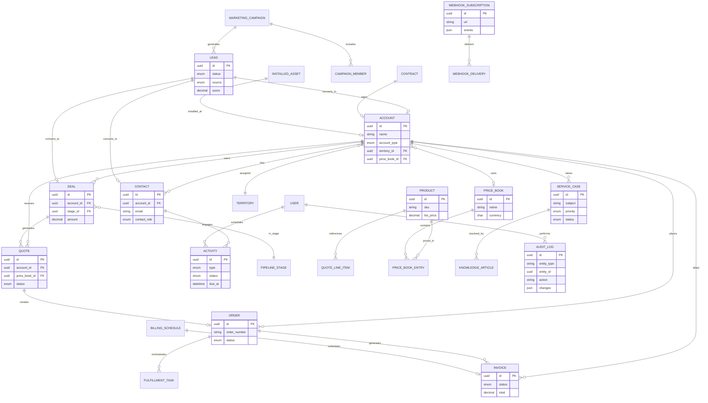

# CRM Data Model

Relational schema implemented in PostgreSQL via Prisma (`apps/api/prisma/schema.prisma`).

## Entity Relationship Diagram

## Entity Count

| Domain | Models |
|--------|--------|
| Sales core | Account, Contact, Lead, Deal, Pipeline, PipelineStage |
| Commercial | Product, PriceBook, PriceBookEntry, Quote, Order, Invoice, Contract |
| Service | ServiceCase, KnowledgeArticle, InstalledAsset, RmaRequest, FieldWorkOrder |
| Marketing | MarketingCampaign, CampaignMember, CadenceTemplate, CustomerJourney |
| Platform | User, Territory, AuditLog, WebhookSubscription, CustomModule, GdprRequest |
| AI / Agents | CopilotSession, Agent, AgentRun, AiAuditLog, GamificationScore |

**Total:** 70+ Prisma models.

## Key Relationships

- **Quote-to-cash:** Deal → Quote → Order → Invoice → BillingSchedule  
- **Lead conversion:** Lead → Account + Contact + Deal (wizard API)  
- **Partner channel:** PortalAccess, DealRegistration, EnablementPath, MdfRequest  
- **Electronics:** InstalledAsset (serial/IMEI), ExportScreening, EOL via Product flags  
- **Customer 360:** Data graph aggregates Account + ERP events + cases + orders

## Indexes & Performance

- Unique: `order_number`, `erp_external_id`, `sku`, user `email`  
- Search: Elasticsearch index (optional) with PostgreSQL `ILIKE` fallback  
- Field history: `FieldHistory` for audit trail per record field